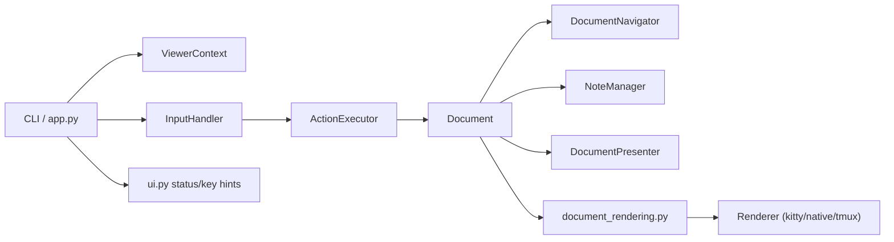
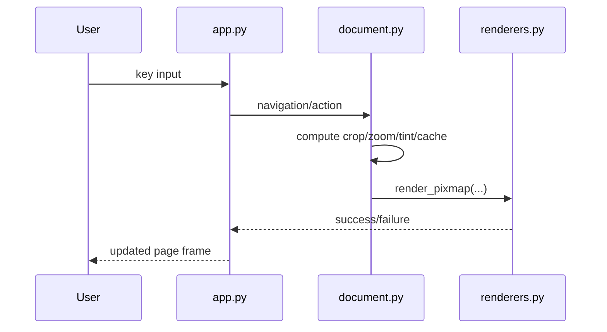

# pdfcat Architecture

**Version**: 2.0 (Post PLAN.md/PLAN2.md Refactoring)
**Date**: 2026-02-15
**Status**: Current implementation

## Overview

`pdfcat` is a keyboard-first PDF viewer for terminal workflows with vim-like keybindings. The architecture follows modern software engineering principles after comprehensive refactoring:

- **Separation of Concerns**: Input handling, business logic, and rendering are separate
- **Dependency Injection**: Components receive dependencies explicitly (no globals)
- **Immutable Actions**: User intents represented as frozen dataclasses
- **Thread Safety**: Proper synchronization with RLocks
- **Memory Bounded**: LRU cache with configurable limits (500MB default)

### Three Core Layers

1. **CLI + Event Loop Orchestration** (`src/pdfcat/app.py`)
   - Reduced from 1,058-line monolithic loop to 142-line orchestration (86.5% reduction)
   - Action-based event system with InputHandler → ActionExecutor pipeline

2. **Document/Navigation/Rendering Domain** (`src/pdfcat/document.py` + specialized modules)
   - Facade pattern with delegation to Navigator, Presenter, NoteManager
   - Thread-safe PageState and LRU PageRenderCache

3. **Terminal Renderer Backends** (`src/pdfcat/renderers.py`)
   - Kitty, Native, Tmux protocol support
   - Environment-based detection (no blocking I/O)

## High-Level Component Map



## Runtime Lifecycle

1. `run()` parses CLI options and creates `ViewerContext`.
2. Active context is registered via `runtime_context.set_context(...)`.
3. `Document` instances are created with context and loaded into buffers.
4. Main loop:
   - read keys
   - map keys to actions
   - execute action
   - render page / update status
5. Shutdown:
   - stop workers
   - cleanup temporary files
   - cleanup renderer resources

## Rendering Pipeline



## Modules and Responsibilities

- `src/pdfcat/app.py`: CLI parsing, viewer loop, lifecycle, dispatch.
- `src/pdfcat/document.py`: `Document` model, state transitions, integration glue.
- `src/pdfcat/document_rendering.py`: page extraction/crop/display helpers.
- `src/pdfcat/document_labels.py`: logical/physical page label conversion.
- `src/pdfcat/document_stream.py`: live text/search stream operations.
- `src/pdfcat/renderers.py`: terminal renderer implementations.
- `src/pdfcat/ui.py`: status bar, shortcuts/help text, visual mode UI behavior.
- `src/pdfcat/runtime_context.py`: process-wide active context accessor.
- `src/pdfcat/context.py`: `ViewerContext` dataclass and cleanup.

## Concurrency Model

- `ViewerContext.worker_pool` handles bounded background work.
- `PageState` and cache metadata are guarded for safe concurrent access.
- shutdown is coordinated through `ViewerContext.shutdown_event`.

## Common Extension Points

- Add a new key action:
  - define/extend action type in `src/pdfcat/actions.py`
  - map input in `src/pdfcat/input_handler.py`
  - execute in `src/pdfcat/executor.py`
- Add renderer behavior:
  - extend `RenderingEngine` implementation in `src/pdfcat/renderers.py`
  - hook selection logic in `create_renderer(...)`
- Add document behavior:
  - keep `Document` orchestration slim
  - move focused logic into a dedicated helper module

---

## Design Patterns Applied

### 1. Action Pattern (Command Pattern)
**Implementation**: `actions.py` (20 frozen dataclasses), `input_handler.py`, `executor.py`
**Benefit**: Decouples input handling from execution, enables logging/replay/undo

### 2. Dependency Injection
**Implementation**: `ViewerContext` in `context.py`, callbacks in `executor.py`
**Benefit**: No global state, easy testing with mocks, clear ownership

### 3. Facade Pattern
**Implementation**: `Document` delegates to `Navigator`, `Presenter`, `NoteManager`
**Benefit**: Backward compatibility, simplified interface, encapsulated complexity

### 4. Strategy Pattern (LRU Cache)
**Implementation**: `PageRenderCache` with OrderedDict-based LRU eviction
**Benefit**: Pluggable eviction policies, memory bounds

### 5. Value Object Pattern
**Implementation**: All Actions are `@dataclass(frozen=True)`
**Benefit**: Thread-safe, immutable, prevents mutation bugs

---

## Security Architecture

### Threat Mitigations

1. **Command Injection Prevention** (`security.py`)
   - `sanitize_command_args()` validates executables with `shutil.which()`
   - All subprocess calls use `shell=False` explicitly
   - ✅ Zero `os.system()` calls in codebase

2. **Path Traversal Protection** (`note_naming.py`, `notes.py`)
   - `slugify_note_title()` removes `../`, `/`, `\` patterns
   - `resolve_note_path()` validates containment in notes directory
   - Security logging for violations

3. **Exception Handling** (`exceptions.py`)
   - Custom exception hierarchy (PdfcatError, DocumentError, SecurityError, etc.)
   - No bare `except:` clauses
   - Specific exception types with logging

**Test Coverage**: >90% for security modules (`test_security.py`, `test_note_security.py`)

---

## Memory Management

### Problem Solved
**Before**: Unbounded cache consumed 4.5GB for 200-page PDFs
**After**: LRU cache bounded at 500MB (configurable via `PDFCAT_CACHE_MB`)

### Implementation (`cache.py`)
```python
class PageRenderCache:
    def __init__(self, max_entries=10, max_bytes=500*1024*1024):
        self._cache = OrderedDict()  # LRU tracking
        self._lock = threading.RLock()  # Thread safety
        self._max_entries = max_entries
        self._max_bytes = max_bytes

    def _evict_if_needed(self):
        # Evict LRU entries until under both limits
        while (len(self._cache) >= self._max_entries or
               self._current_bytes >= self._max_bytes):
            self._cache.popitem(last=False)  # Remove oldest
```

**Configuration**:
```bash
export PDFCAT_CACHE_MB=1000  # 1GB cache
pdfcat document.pdf
```

---

## Threading Model

### Synchronization Primitives

**PageState** (`page_state.py`):
```python
@dataclass
class PageState:
    _lock: threading.RLock = field(default_factory=threading.RLock)

    def get_cached_render(self):
        with self._lock:
            return self._cached_render
```

**PageRenderCache** (`cache.py`):
```python
class PageRenderCache:
    def __init__(self):
        self._lock = threading.RLock()

    def get(self, key):
        with self._lock:
            return self._cache.get(key)
```

### Thread Categories
1. **Main Thread**: Event loop, input handling, terminal rendering
2. **Worker Threads**: Prerendering adjacent pages (ThreadPoolExecutor)
3. **External Processes**: Neovim bridge, external PDF viewers

---

## Code Quality Metrics

### Architecture Improvement
| Metric | Before | After | Improvement |
|--------|--------|-------|-------------|
| View loop size | 1,058 lines | 142 lines | 86.5% reduction |
| Global state modules | `state.py` | None | Eliminated |
| Action types | N/A | 20 | Structured |
| Security tests | 0 | >90% coverage | New |

### File Organization
```
src/pdfcat/
├── Architecture (746 lines)
│   ├── actions.py (199)        # Action value objects
│   ├── input_handler.py (247)  # Input → Actions
│   ├── executor.py (240)       # Action execution
│   ├── context.py (42)         # ViewerContext (DI)
│   └── runtime_context.py (18) # Context accessor
│
├── Threading & Memory (450 lines)
│   ├── page_state.py (~150)    # Thread-safe page state
│   └── cache.py (~200)         # LRU cache
│
├── Security (170 lines)
│   ├── security.py (~80)       # Sanitization
│   ├── exceptions.py (~50)     # Exception hierarchy
│   └── note_naming.py (~40)    # Path protection
│
└── Document Decomposition (1,460 lines)
    ├── navigator.py (61)       # Navigation
    ├── presenter.py (47)       # Presentation coordinator
    ├── notes.py (192)          # Note management
    ├── presenter_links.py (481)    # Link handling
    ├── presenter_views.py (196)    # TOC/metadata
    ├── document_labels.py (121)    # Page labels
    ├── document_rendering.py (263) # Rendering pipeline
    └── document_stream.py (99)     # Stream operations
```

---

## Quick Reference

### Verification Commands
```bash
# Security checks
grep -r "os.system\|shell=True" src/pdfcat/  # Should be empty
grep -r "except:" src/pdfcat/ | grep -v "except ("  # Should be empty

# Architecture verification
ls src/pdfcat/{input_handler,executor,actions,context}.py
ls src/pdfcat/state.py  # Should not exist

# Run security tests
pytest tests/test_security.py tests/test_note_security.py -v
```

### Key Bindings (Post PLAN2.md)
```
b           # Next buffer (single key, was 'bb')
[count]b    # Next [count] buffers (e.g., 3b)
B           # Previous buffer (single key, was 'BB')
[count]B    # Previous [count] buffers (e.g., 5B)
```

---

**Last Updated**: 2026-02-15 | **See Also**: [IMPLEMENTATION_SUMMARY.md](../IMPLEMENTATION_SUMMARY.md)
